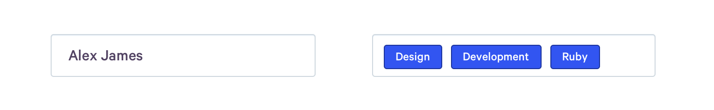

“Buttons, inputs, typography“. The foundations of any design system right? As engineers and designers, it often helps us to break up a UI in to a collection of smaller parts. Whether these manifest as symbols in our design tools, or components in our codebases, these smaller chunks are often used as the grounds for a UI system.

However if we dig deeper, we can still find shared patterns among these components, whether it be font sizing, or spacing, or colour.

As an experiment, try breaking down the elements of your UI in to their most primitive values. For example for a dropdown, this might be:

- the font sizing of the placeholder
- the background color of the box
- the border style of the box

These values are often duplicated across multiple components. For example, the border color of a select box on hover, will likely be the same as the border color of a text input or checkbox.


## Encouraging experimentation with tokens

Defining components as the lowest elements of a system provides little room for experimentation without either creating variants of an existing component; composing existing components to make a new larger component; or creating an entirely new component.

Tokens provide a nice route to opt out of the provided components, but still remain within the bounds of the system. For example, an engineer may want to build a variant of an input, that although visually looks similar to a normal input, may have a wildly different technical implementation.

Consider the following two components. Although both the wrapping input is visually similar, they must have two seperate implementations to allow for non-text content to be added to the input.



The implementation of the first component might be as simple as:

```html
<input type="text" value="Alex James" />
```

Where as the second component might look like this:
_(example written in JSX)_

```html
<VisualInput>
  <Tag>Design</Tag>
  <Tag>Development</Tag>
  <Tag>Ruby</Tag>
</VisualInput>
```

Although the implementations of the styles of these components may be different, the values can be shared with tools such as [Theo](https://github.com/salesforce-ux/theo), which can auto generate tokens into multiple languages and technologies.

For example, by storing tokens in JSON and passing them in to Theo, we can generate CSS variables, and a CSS-in-JS theme.

```json
{
  "input": {
    "defaultBorderColor": "1px solid #cfd8df",
    "hoverBorderColor": "1px solid #3255F1"
  }
}
```

Auto-generated CSS variables:

```css
:root {
  --inputDefaultBorderColor: 1px solid #cfd8df;
  --inputhoverBorderColor: 1px solid #3255f1;
}

/* Example usage */
input {
  border: var(--inputDefaultBordercolor);
}

input:hover {
  border: var(--inputHoverBordercolor);
}
```

A css-in-js implementation:

```js
const theme = {
  input: {
    defaultBorderColor: '1px solid #cfd8df',
    hoverBorderColor: '1px solid #3255F1',
  },
};

const VisualInput = styled.div`
  border: ${props => props.theme.input.defaultBorderColor};

  &:hover {
    ${props => props.theme.input.hoverBorderColor};
  }
`;

// Example usage
<ThemeProvider theme={theme}>
  <VisualInput />
</ThemeProvider>;
```

---

As design systems mature, 2019 will see an increase in the uptake of industry wide design systems (think Material Design). We've already seen a glimpse of this future with features such as the [Store in Framer X](https://framer.com/features/store/).

The requirement then, will be on being able to write styles for a component in a way that can be shared across multiple technologies.

---

## Further reading

1. [Dan Eden on Designing Product UI Systems](https://daneden.me/2017/03/29/designing-systems/)
2. [styled-system - A React library for building design systems using a theme/tokens approach](https://github.com/jxnblk/styled-system)
