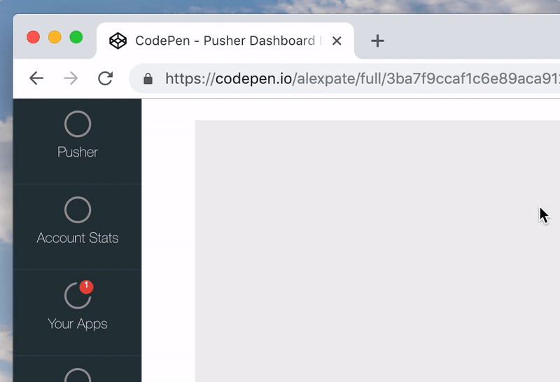

Pusher is a developer tooling company that offers hosted API's to add real-time functionality to apps and websites. With around 250,000 customers including companies such as GitHub, The Financial Times, and InVision

Although API's being the primary product, the client dashboard is the primary way that developers interact and configure their Pusher instances.

As the product had grown in scale, the dashboard was beginning to suffer from feature overload with new views and features being added with little consideration to the overarching user experience. Being built from a very vanilla version of Bootstrap there was a lack of branding on the site, which although wasn't hindering any functionality, it did bring in to question the authenticity of the product in the payment and upsell flows.

---

## Content hierarchy and navigation
The site hierarchy and the way in which users navigate around the dashboard was one of the first areas that we looked at. There was no existing hierarchy between 

As an alternative, we designed a three tier navigation:

1. **The global user menu** - This sits at the top of every page, and allowed users to quickly access global links such as their account settings, or documentation.
2. **App global menu** - Like the user menu, the app menu is persistent and allows quick access to view app stats, the dashboard home page, and the create new app view.
3. **View specific navigation** - This sits within the main content of the page, and was used for accessing views lower down in the tree such as app settings.

## Prototyping early
Whilst the design lead was building out wireframes, I began to prototype the different layouts to pass around the team and get feedback on. These helped to identify potential issues such as how the site should adapt at really large screen sizes.

- [Dashboard navigation interaction](https://codepen.io/alexpate/full/3ba7f9ccaf1c6e89aca912fc8e4fb965)
- [Full width app layout](https://codepen.io/alexpate/full/9ba104228c41df58bda7b1fe88aa0d34)
- [Modal prototype](https://codepen.io/alexpate/full/79e17e2135fcf923e0324fbcb10a4970)

---

## Ensuring consistency through the UI library

With the product rapidly growing in both scale and number of features, it was important to create and document patterns that could quickly be used by other designers and engineers to build consistent usable features.

Along side the development of the new dashboard, we also developed a UI library ([Chameleon](https://pusher.github.io/chameleon/chameleon/getting-started)) that contained all of the low level components along with documentation on how to use them.

Although the intention was to only use this for the main dashboard, it was later rolled out across the marketing site, internal admin, and used in numerous demos by our Developer Evangelists.

## User testing and feedback

One of the benefits of building tooling for developers, is being surrounded by your own customers. We started small by shipping small prototypes to the rest of the team, but then began to grow the scope of our testing group by deploying the new dashboard to production behind a beta flag. This allowed us to roll out the new design incrementally to a pre-selected set of users who had agreed to give feedback. We were then able to review user sessions using FullStory, which helped identify broken features such as a form that didn't submit due to an invisible validation error.