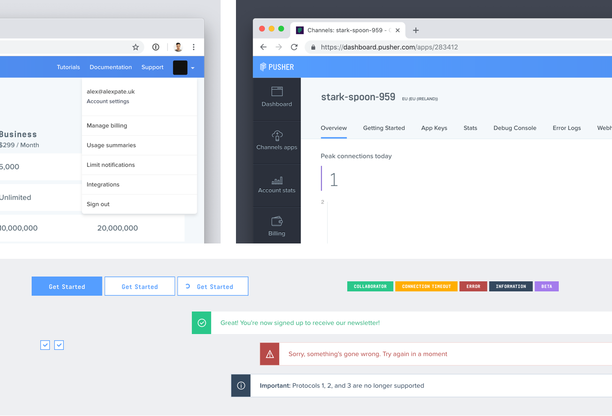
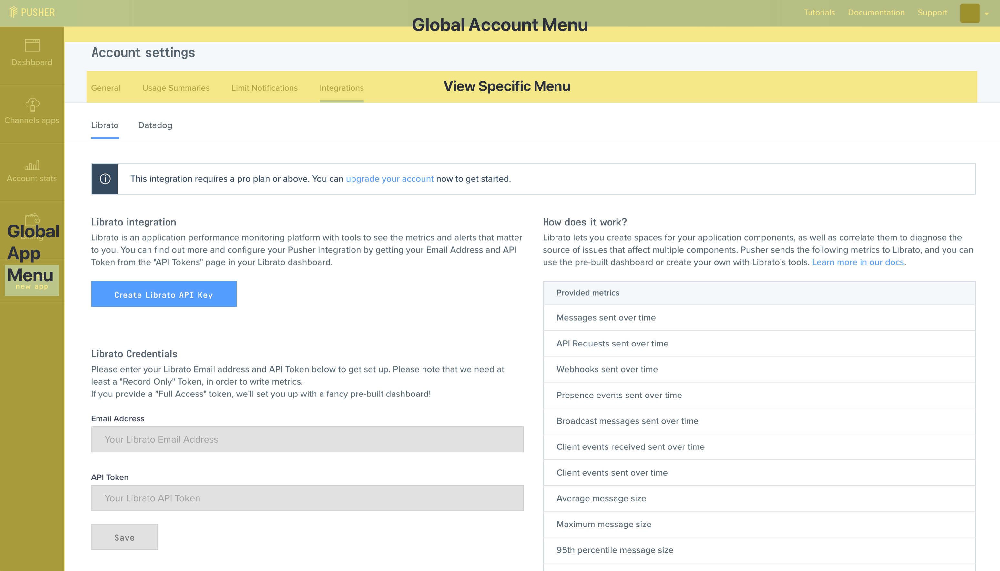
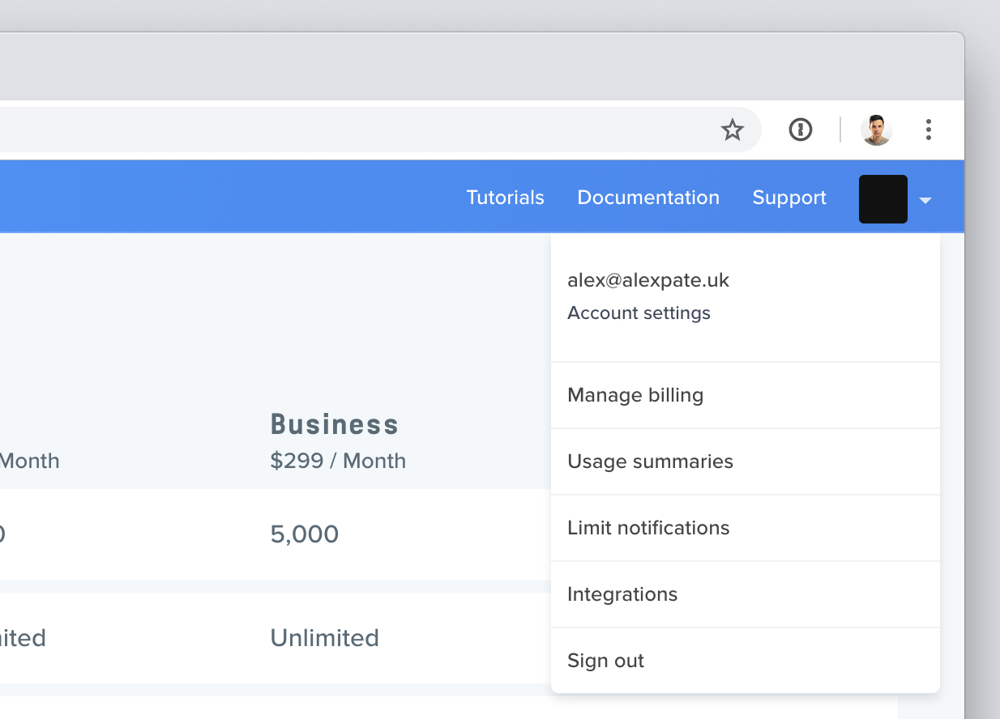

Pusher is a developer tooling company that offers hosted API's to add real-time functionality to apps and websites. With around 250,000 customers including companies such as GitHub, The Financial Times, and InVision

Although API's being the primary product, the client dashboard is the primary way that developers interact and configure their Pusher instances.

<!--  -->
As is the case with a lot of early stage products, the dashboard had suffered from feature overload, with new views and features being added with little consideration to the overarching user experience and aesthetic.

---

## Content hierarchy and navigation
The site hierarchy and the way in which users navigate around the dashboard was one of the first areas that we looked at. There was no existing hierarchy between 

As an alternative, we designed a three tier navigation:

1. **The global user menu** - This sits at the top of every page, and allowed users to quickly access global links such as their account settings, or documentation.
2. **App global menu** - Like the user menu, the app menu is persistent and allows quick access to view app stats, the dashboard home page, and the create new app view.
3. **View specific navigation** - This sits within the main content of the page, and was used for accessing views lower down in the tree such as app settings.

